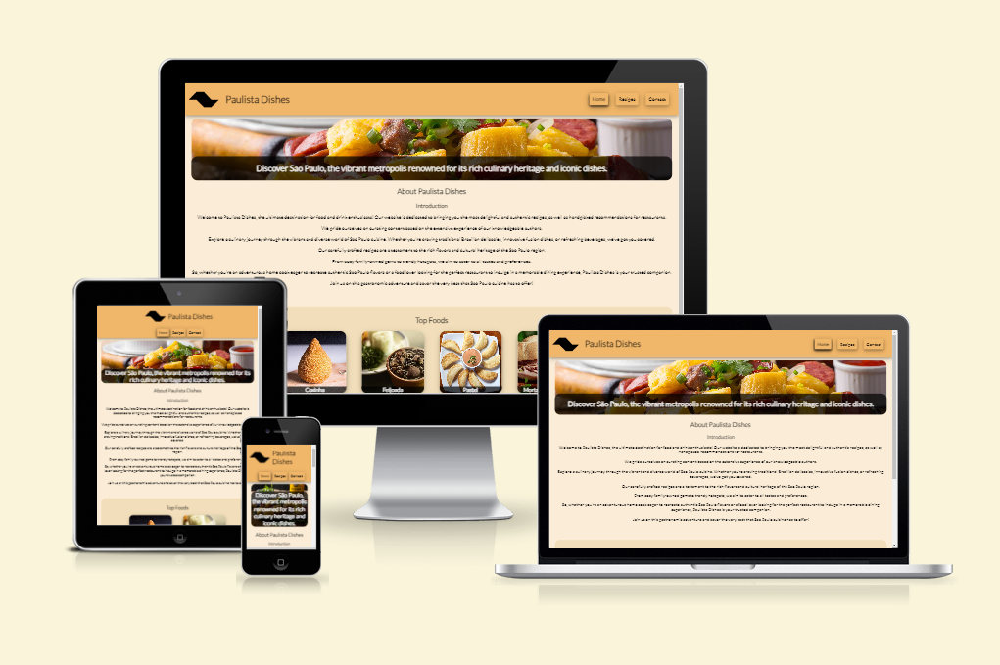
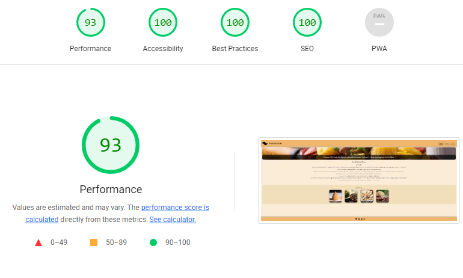
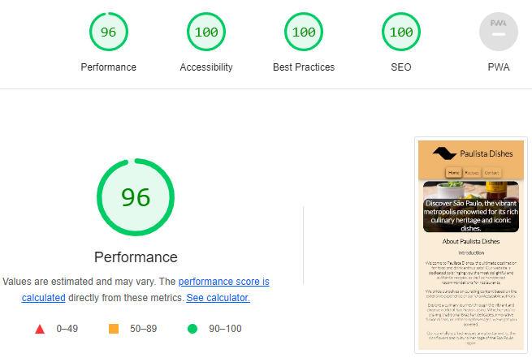

<h1 align="center">Paulista Dishes Website</h1>

[View the live project here.](https://danvm94.github.io/paulista-dishes/)

This is the main website for Sao Paulo's most famous dishes. It is designed to be responsive and accessible on a range of devices, making it easy to navigate for food enthusiasts and culinary partners.

<h2 align="center"></h2>

## User Experience (UX)

- ### User stories

  - #### First Time Visitor Goals

    1. As a First Time Visitor, I want to easily understand the main purpose of the site and learn more about the organisation.
    2. As a First Time Visitor, I want to be able to easily navigate throughout the site to find content.
    3. As a First Time Visitor, I want to find the recipes that I am looking for easily.

  - #### Returning Visitor Goals

    1. As a Returning Visitor, I want to explore new recipes and discover fresh ideas.
    2. As a Returning Visitor, I want to easily access my saved or favorite recipes.
    3. As a Returning Visitor, I want to share my own recipes or recommendations with the community.
    4. As a Returning Visitor, I want to see any updates or new content since my last visit.

  - #### Frequent User Goals
    1. As a Frequent User, I want to quickly find my go-to recipes and access them easily.
    2. As a Frequent User, I want to contribute my own variations or modifications to existing recipes.
    3. As a Frequent User, I want to easily share recipes with friends and family.

- ### Design
  - #### Colour Scheme
    1.  `#faecd6`: This light, creamy colour (#faecd6) is used as the background colour for the overall website. It creates a warm and inviting atmosphere and complements the food-related content.
    2.  `#f0b669`: This vibrant, golden colour (#f0b669) is used for important elements such as headers, buttons, and certain sections. It adds energy and a touch of elegance to the design, grabbing attention and guiding the user's focus.
    3.  `#f2deba`: This soft, pastel colour (#f2deba) is used as a background or accent colour for specific sections or containers. It provides a gentle contrast to the other colours and helps create visual hierarchy within the content.
  - #### Typography
    - The main font used for the website is "Lato", a clean and modern sans-serif typeface. It offers excellent readability, making it suitable for presenting the main content to users.
  - #### Imagery
    - Imagery plays a crucial role in capturing the user's attention and creating an engaging visual experience on the recipe's website. The home webpage prominently features an illustrative dish image positioned at the top. This image serves as a focal point, immediately drawing the user's attention and piquing their interest in exploring further.

* ### Wireframes

  - Home Page Wireframe - [View](./readme/index.png)

  - Recipes Wireframe - [View](./readme/recipes.png)

  - Contact Us Page Wireframe - [View](./readme/contact.png)

## Features

- Responsive on all device sizes

- Interactive elements

## Technologies Used

### Languages Used

- [HTML5](https://en.wikipedia.org/wiki/HTML5)
- [CSS3](https://en.wikipedia.org/wiki/Cascading_Style_Sheets)

### Frameworks, Libraries & Programs Used

1. [BEM Methodology:](https://getbem.com/introduction/)
   - BEM Methodology was used for structuring and organizing the CSS codebase, providing a modular and scalable approach to styling components.
1. [Hover.css:](https://ianlunn.github.io/Hover/)
   - Hover.css was used on the Social Media icons in the footer to add the float transition while being hovered over.
1. [Google Fonts:](https://fonts.google.com/)
   - Google fonts were used to import the 'Titillium Web' font into the style.css file which is used on all pages throughout the project.
1. [Font Awesome:](https://fontawesome.com/)
   - Font Awesome was used on all pages throughout the website to add icons for aesthetic and UX purposes.
1. [Git](https://git-scm.com/)
   - Git was used for version control by utilizing the Gitpod terminal to commit to Git and Push to GitHub.
1. [GitHub:](https://github.com/)
   - GitHub is used to store the projects code after being pushed from Git.
1. [Balsamiq:](https://balsamiq.com/)
   - Balsamiq was used to create the [wireframes](https://github.com/) during the design process.

## Testing

### Code Testing

The W3 HTML Validator and W3C CSS Validator Services were used to validate every page of the project to ensure there were no syntax errors in the project.

- [W3 HTML Validator](https://validator.w3.org/) - [Results](https://validator.w3.org/nu/?doc=https%3A%2F%2Fdanvm94.github.io%2Fpaulista-dishes%2F)
- [W3C CSS Validator](https://jigsaw.w3.org/css-validator/) - [Results](https://jigsaw.w3.org/css-validator/validator?uri=https%3A%2F%2Fdanvm94.github.io%2Fpaulista-dishes%2F&profile=css3svg&usermedium=all&warning=1&vextwarning=&lang=en)

### Lighthouse Testing

The Google Chrome built-in Lighthouse testing tool was utilized to assess the performance, accessibility, best practices and SEO aspects of the three available website pages. Below are the results obtained for each page, considering both the desktop and mobile versions.

#### index.html

##### Desktop



- [Full Report](https://danvm94.github.io/paulista-dishes/readme/index-desktop.html)

##### Mobile



- [Full Report](https://danvm94.github.io/paulista-dishes/readme/index-mobile.html)

### Testing User Stories from User Experience (UX) Section

- #### First Time Visitor Goals

  1. As a First Time Visitor, I want to easily understand the main purpose of the site and learn more about the organisation.

     1. Upon entering the site, users are automatically greeted with a clean and easily readable navigation bar to go to the page of their choice. Underneath there is a dish image with a brief description "Discover São Paulo, the vibrant metropolis renowned for its rich culinary heritage and iconic dishes.".
     2. After the image, the user will find an "About" section that provides a description of the website's purpose.
     3. Following the "About" section, the user will come across the final section featuring a concise overview of the top four dishes available on the website.

  2. As a First Time Visitor, I want to be able to easily be able to navigate throughout the site to find content.

     1. The site has been designed to be fluid and never to entrap the user. At the top of each page there is a clean navigation bar, each link describes what the page they will end up at clearly.
     2. In the "Top Foods" section, users can conveniently select their desired recipe, which will redirect them directly to their chosen option.

  3. As a First Time Visitor, I want to look for testimonials to understand what their users think of them and see if they are trusted. I also want to locate their social media links to see their following on social media to determine how trusted and known they are.
     1. Once the new visitor has read the "About Paulista Dishes" text, it becomes possible to gauge the initial impressions and opinions of users regarding the website.
     2. The user can also scroll to the bottom of any page on the site to locate social media links in the footer.

- #### Returning Visitor Goals

  1. As a returning visitor, my primary goal is to locate the recipes I enjoy and discover new recipes that are available.

     1. These are clearly shown in the "Top Foods" section.
     2. They will be directed to a page with the recipe's instructions.

  2. As a Returning Visitor, I want to find the best way to get in contact with the organisation with any questions I may have.

     1. The navigation bar clearly highlights the "Contact" Page.
     2. Here they can fill out the form on the page.
     3. The footer contains links to the organisations Facebook, Twitter and Instagram page.
     4. Whichever link they click, it will be open up in a new tab to ensure the user can easily get back to the website.

  3. As a Returning Visitor, I want to find the Facebook Group link so that I can join and interact with others in the community.
     1. The Facebook Page can be found at the footer of every page and will open a new tab for the user and more information can be found on the Facebook page.

- #### Frequent User Goals

  1. As a Frequent User, my primary goal is to locate the recipes I enjoy and discover new recipes that are available.

     1. These are clearly shown in the "Top Foods" section.
     2. They will be directed to a page with the recipe's instructions.
     3. The user, being familiar with the website layout, can effortlessly navigate through the website with ease and convenience.

  2. As a Frequent User, I want to submit recipes or restaurants sugestions.

     1. The user can easily submit their suggestions by accessing the "Contact" page, conveniently located in the top navigation bar of the website.

### Further Testing

- The Website was tested on Google Chrome, Internet Explorer, Microsoft Edge and Safari browsers.
- The website was viewed on a variety of devices such as Desktop, Laptop, iPhone7, iPhone 8 & iPhoneX.
- A large amount of testing was done to ensure that all pages were linking correctly.
- Friends and family members were asked to review the site and documentation to point out any bugs and/or user experience issues.

### Known Bugs

1. Some mobile devices with extremely small screen widths may encounter issues with the webpage not fitting correctly on their screens.

   1. In the top section image, the subtitle may overlap with the navigation bar, rendering it impossible to click on the navigation bar links.

   2. In the "Top Foods" section, the images may exceed the width of their container, causing display problems.

   3. The top navigation bar may not be able to accommodate all three links on the same line, resulting in the contact page being positioned below the home button and causing overlaps with both the home and recipes buttons.

## Deployment

### Forking the GitHub Repository

By forking the GitHub Repository we make a copy of the original repository on our GitHub account to view and/or make changes without affecting the original repository by using the following steps...

1. Log in to GitHub and locate the [GitHub Repository](https://github.com/Danvm94/paulista-dishes)
2. At the top of the Repository (not top of page) just above the "Settings" Button on the menu, locate the "Fork" Button.
3. You should now have a copy of the original repository in your GitHub account.

### GitHub Pages

The project was deployed to GitHub Pages using the following steps...

1. Log in to GitHub and locate your forked version of the "paulista-dishes" project.
2. At the top of the Repository (not top of page), locate the "Settings" Button on the menu.
3. Scroll down the Settings page until you locate the "Pages" Section.
4. Under "Source", click the dropdown called "None" and select "Master Branch".
5. The page will automatically refresh.
6. Scroll back down through the page to locate the now published site link in the "Pages" section.

### Making a Local Clone

1. Log in to GitHub and locate the [GitHub Repository](https://github.com/)
2. Under the repository name, click "Clone or download".
3. To clone the repository using HTTPS, under "Clone with HTTPS", copy the link.
4. Open Git Bash
5. Change the current working directory to the location where you want the cloned directory to be made.
6. Type `git clone`, and then paste the URL you copied in Step 3.

```
$ git clone https://github.com/YOUR-USERNAME/YOUR-REPOSITORY
```

7. Press Enter. Your local clone will be created.

```
$ git clone https://github.com/YOUR-USERNAME/YOUR-REPOSITORY
> Cloning into `CI-Clone`...
> remote: Counting objects: 10, done.
> remote: Compressing objects: 100% (8/8), done.
> remove: Total 10 (delta 1), reused 10 (delta 1)
> Unpacking objects: 100% (10/10), done.
```

Click [Here](https://help.github.com/en/github/creating-cloning-and-archiving-repositories/cloning-a-repository#cloning-a-repository-to-github-desktop) to retrieve pictures for some of the buttons and more detailed explanations of the above process.

## Credits

### Code

- [BEM Methodology](https://getbem.com/introduction/): BEM Methodology was used for structuring and organizing the CSS codebase, providing a modular and scalable approach to styling components.

- [CSS-Tricks](https://css-tricks.com/) : CSS-Tricks provides a comprehensive tutorial on the display: flex property, which greatly enhances understanding and ensures correctness when using flexbox layouts. You can access the tutorial by clicking [Here](https://css-tricks.com/snippets/css/a-guide-to-flexbox/)

### Content

- All the recipes were translated and adjusted according to the developer's preferences using references from [Tasty](https://tasty.co/) and [TudoGostoso](https://www.tudogostoso.com.br/).

- Psychological properties of colours text in the README.md was found [here](http://www.colour-affects.co.uk/psychological-properties-of-colours)

### Media

- [Pixabay](https://pixabay.com/): For sourcing free images, Pixabay was utilized as the image provider for this purpose to the entire website except the header logo.

- [Youtube](https://youtube.com/): Recipe videos were sourced from various YouTube channels. You can identify the specific YouTube channel by referring to the top-left icon in the video or by opening the video on the YouTube platform itself.

### Acknowledgements

- My Mentor for continuous helpful feedback.

- [Lucas Campos](https://github.com/luccamps): I would like to express my gratitude to Lucas Campos for his assistance and guidance. His expertise in CSS and his willingness to share his knowledge have greatly contributed to my understanding of the display:flex property.

- [Douglas Melo](https://github.com/DouglasMeloo): I would like to thank Douglas Melo for conducting tests on this project. His valuable input provided an additional confirmation of the project's functionality on different hosts, beyond my own local testing.
